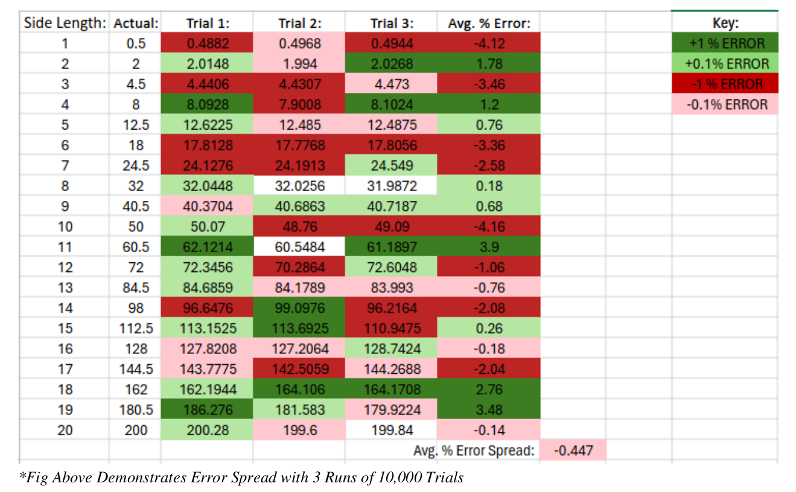
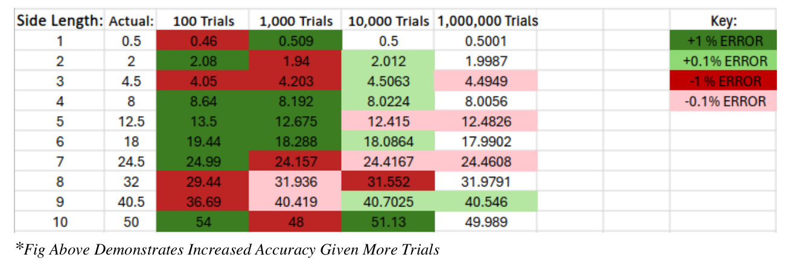

# Triangle Area Estimation Using Monte Carlo Simulation

## Description
This project implements a Python program to estimate the area of a triangle using Monte Carlo simulation. The process involves randomly placing points within a square of user-defined side length. The triangle shares the same height and width as the square and is formed by a hypotenuse that divides the square in half, connecting two adjacent corners.

The actual area of the triangle is known to be half that of the square, which can be easily calculated using the square's side length. However, the purpose of this program is to estimate the area through recursive plotting, demonstrating the effectiveness of the Monte Carlo method.

---

## Experimental Data:

---

## Analysis
- **Accuracy**: The model proved to be fairly accurate. Testing revealed a slight bias toward underestimating the triangle's area, with an average error margin of –0.447%. However, this finding is based on a limited sample size and is not definitive.
  
- **Improved Accuracy with Higher Trials**: Additional testing showed that increasing the number of trials improved accuracy. This trend is evident when comparing error percentages at 1% and 0.1%, as seen in the second figure.

---

This project demonstrates the utility of Monte Carlo methods for estimation and highlights the relationship between sample size and accuracy in statistical modeling.
